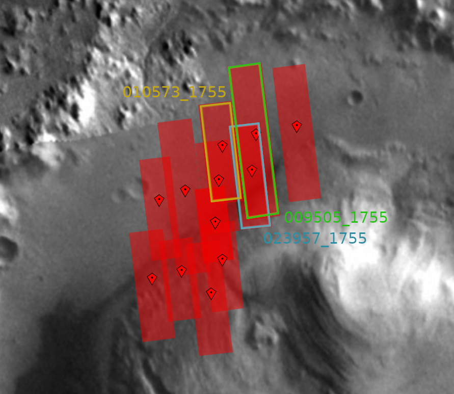

* [023957_1755 - MSL Landing Site](https://www.uahirise.org/dtm/dtm.php?ID=ESP_023957_1755)
  * 4.56 deg S, 137.4 deg E
* [009505_1755 - Crater Floor and Central Mound](https://www.uahirise.org/dtm/dtm.php?ID=PSP_009505_1755)
  * 4.46 deg S, 137.5 deg E
* [010573_1755 - Possible MSL Landing Site](https://www.uahirise.org/dtm/dtm.php?ID=PSP_010573_1755)
  * 4.49 deg S, 137.4 deg E